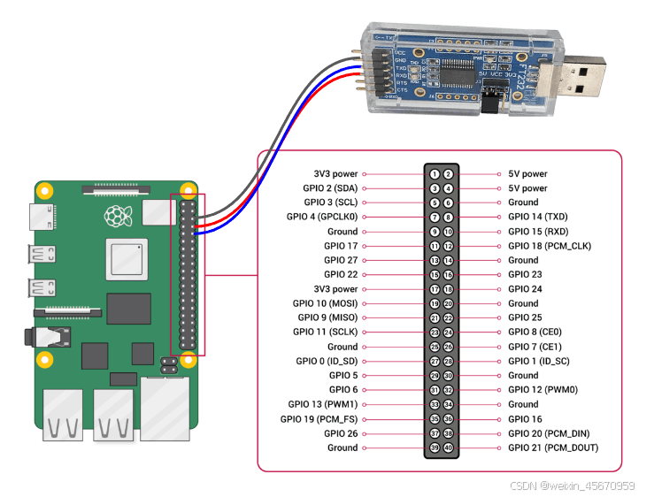

# Setup adb to Pi

## Steps:

### Network Connection:
Ensure both the Raspberry Pi and your host computer are connected to the same Wi-Fi network.

### Connect your host computer to the Raspberry Pi using a USB-TTL converter.


### In the Raspberry Pi's console, set up the IP address and port:
```console
su
setprop service.adb.tcp.port 5555
stop adbd
start adbd
```

### Replace <IP_of_Pi> with the actual IP address of your Raspberry Pi:
```console
ifconfig wlan0 <IP_of_Pi>
```

### Connect to the Raspberry Pi via ADB from your host computer:
```console
adb connect <IP_of_Pi> 5555
adb shell
```