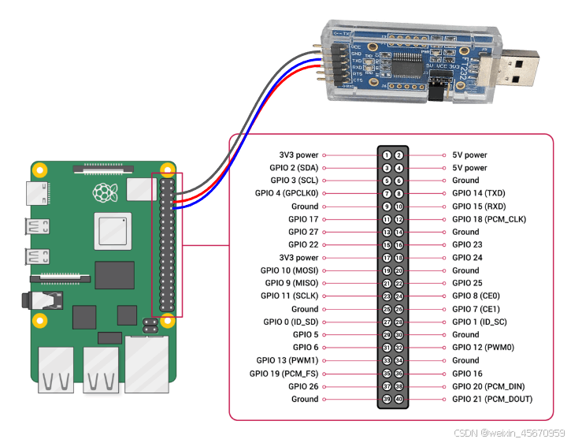
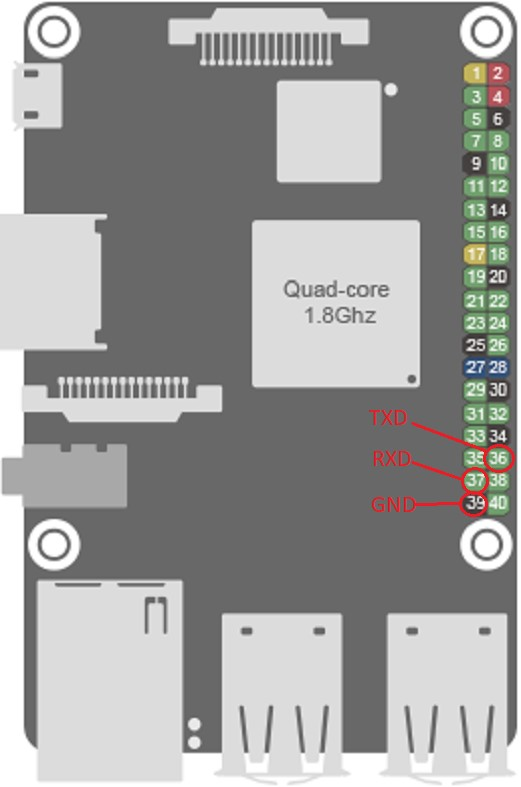
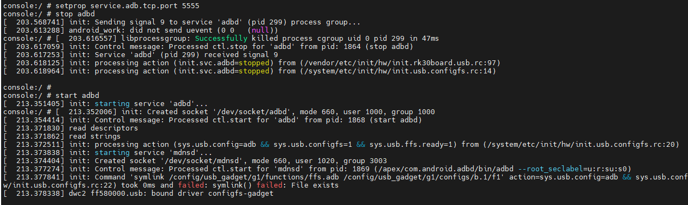
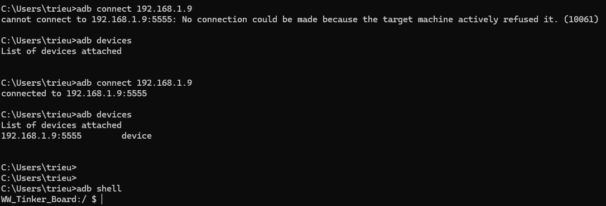

# Setup adb to Pi/Tinker R2.0

## Steps

### Network Connection
Ensure both the Raspberry Pi and your host computer are connected to the same Wi-Fi network.

### Connect your host computer to the Raspberry Pi/Tinker Board using a USB-TTL converter
> **Note:** For Tinker board 2/2S, adb can directly connect via On-Board USB Type-C.
- **For Raspberry Pi**



- **For Tinker Board R2.0**
> - **Connect TXD** pin on the converter to **pin 36** on the Tinker Board.  
> - **Connect RXD** pin on the converter to **pin 37** on the Tinker Board.  
> - **Connect GND** pin on the converter to **pin 39** on the Tinker Board.  



### In the target's console, set up the IP address and port
```console
su
setprop service.adb.tcp.port 5555
stop adbd
start adbd
```
> Ex:

### Replace <IP_of_Pi> with the actual IP address of your Target (optional)
```console
ifconfig wlan0 <IP_of_Target>
```
### Connect to the Target via ADB from your host computer
```console
adb connect <IP_of_Target> 5555
adb shell
```
>Ex:


## References  
- [Tinker Board Developer Guide](https://github-wiki-see.page/m/TinkerBoard/TinkerBoard/wiki/Developer-Guide)  
